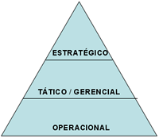

# 🚧 Capítulo 1 - Cronologia e Introdução
---

Antes de começar a estudar a análise de sistemas da informação é necessário entender alguns conceitos inciais.

## Dados x Informações: 
---

Dados são conjuntos de valores armazenados em algum lugar, sem tratamento.

Informações são dados organizados/ordenados/processados que significam algo e tem utilidade para a tomada de decisão. A qualidade da informação deve ser definida pelos seguintes aspectos:

- Prontidão
- Aceitação
- Frequência
- Período
- Precisão
- Relevância
- Integridade
- Concisão
- Amplitude
- Desempenho
- Clareza e Detalhe
- Ordem
- Apresentação
- Mídia

Conhecimento é a informação valiosa, acumulada e verificada por muito tempo.

## Organização Empresarial
---

A organização de qualquer empresa é feita em setores ou departamentos com objetivos diferentes porém sempre visando o LUCRO.

A administração da empresa pode ser dividida em:

- Estratégico: alto escalão, dá as mais importantes decisões
- Tático: escalão intermediário, decisões de menor impacto
- Operacional: baixo escalão, decisões do dia a dia.

## Sistemas de Informação nas Empresas
---

Os sistemas da informação recolhem, processam, armazenam, distribuem informação para apoiar a tomada de decisão das empresas. 

Eles possuem muita informação sobre o **ambiente do sistema,** podendo ser definido como o conjunto de fatores que interferem no sistema de dentro e de fora.

## O Analista de Sistemas
---

É o responsável por fazer a Análise de Sistema, deve entender e avaliar as necessidades de um sistema e dizer se essas são estão sendo cumpridas, para atender a expectativa do cliente para a melhor implantação/criação/implementação de um sistema.