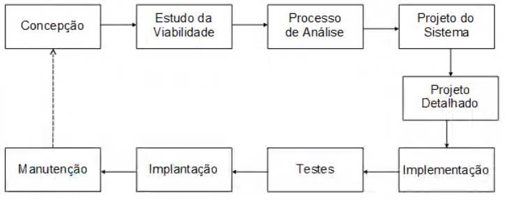

## 🚧 Fases do desenvolvimento de um SI: 
---

Para a criação de um software a equipe de desenvolvimento deve seguir uma série de etapas, permitindo a produção de forma estruturada e organizada.

## Concepção do SI

Fase inicial sem detalhes, o analista deve fazer um entendimento das necessidades e custos. Produção de um relatório ao final das reuniões, que estima prazo, levantamento de soluções...

## Estudo da viabilidade

Estudo dos custos e benefícios para avaliar se a produção do software vale a pena. Algumas vezes é mais viável comprar um software pronto do que desenvolver o mesmo(  _viabilidade técnica_ + viabilidade econômica).

- Viabilidade técnica consiste da cultura e organização do cliente, da familiaridade dos usuários com a TI e a aceitação de novas tecnologias.

## Processo de Análise

Levantamento minucioso de dados e fatos para descobrir o que precisa ser feito pelo sistema. A equipe de análise de sistemas vai:

- Ouvir o usuário;
- Trocar sugestões;
- Atentar para sua expectativa;
- Avaliar a realidade cotidiana da organização.

Deve existir uma grande sintonia entre *usuário e a equipe de análise*. O problema deve ser resolvido de uma vez por todas.

**Stalkeholder:** pessoa com interesse pelo projeto.

É indispensável **levantar todos os fatores** que podem gerar informações importantes para tomada de decisão, esse levantamento pode se dar por meio de:

- Pesquisas em documentos;
- Entrevistas com usuários / futuros usuários;
- Análise de arquivos da empresa, etc.

Esse levantamento recebe o nome de **Coleta e
Análise de Requisitos** que gera um relatório(que pode ser mudado/revalidado) contendo: listagem de objetivos, funcionamento do sistema, métodos de atualização, prazo, modelo lógico...

## Projeto de Sistema

Fase em que são buscadas alternativas de solução, apresentando relatórios para cada alternativa listando custos e benefícios de cada uma, diagrama de casos de uso, tipos de banco de dados, layouts, especificações...

### Projeto Detalhado

Ao concluir o projeto do sistema

